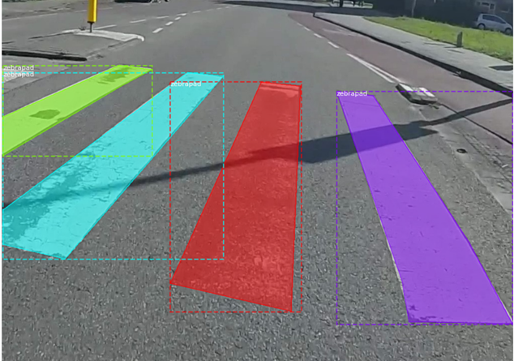
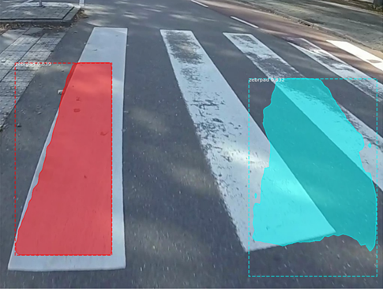
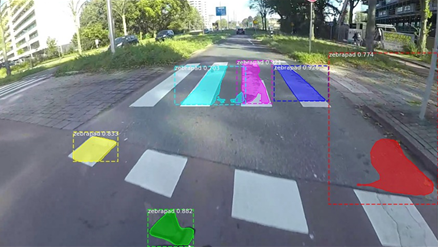
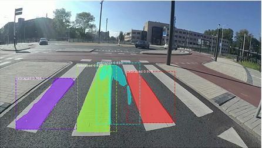
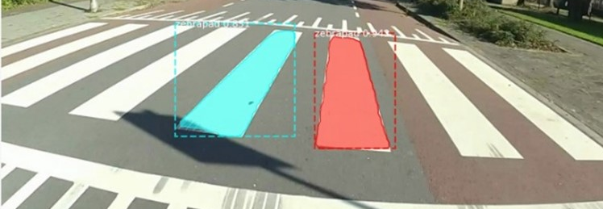
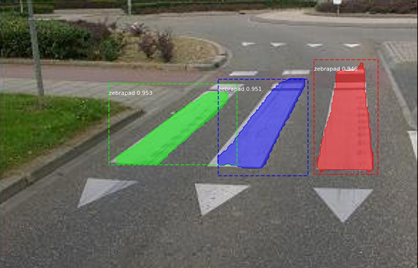
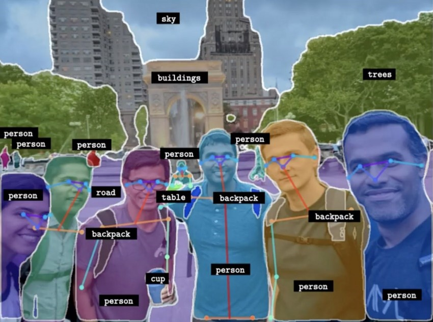
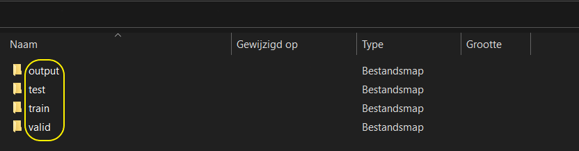
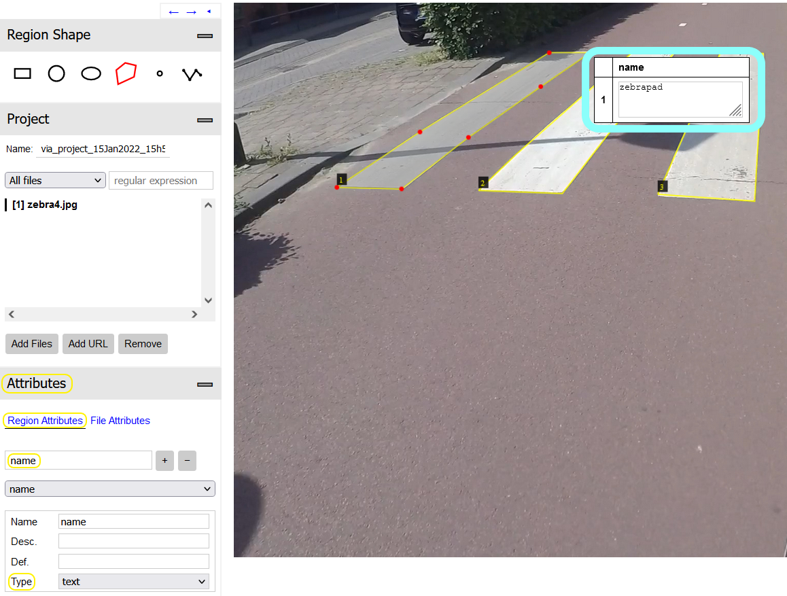

# Fietskoerier
In deze repository is het model voor het wegmarkeringen project terug te vinden. Het doel van het project is om wegmarkeringen te kunnen identificeren op een foto, en deze classificeren op schade. De classificatie is aan de hand van de CROW-normeringen, die in tweede onderstaande figuur worden weergegeven. In de onderstaande figuur is het doel van het project weergegeven; Geclassificeerde wegmarkering. 

 
 

 

 

# Inhoudsopgave
1. [ **Mask-RCNN** ](https://gitlab.fdmci.hva.nl/karaye/fietskoerier/-/tree/feature/detectron2#mask-rcnn)
    1. [Data Mask-RCNN](https://gitlab.fdmci.hva.nl/karaye/fietskoerier/-/tree/feature/detectron2#data-mask-rcnn)
    2. [Stappen plan annoteren Mask-RCNN](https://gitlab.fdmci.hva.nl/karaye/fietskoerier/-/tree/feature/detectron2#stappen-plan-annoteren-mask-rcnn)
    3. [Opzetten Mask-RCNN](https://gitlab.fdmci.hva.nl/karaye/fietskoerier/-/tree/feature/detectron2#opzetten-van-mask-rcnn)
    4. [Resultaten Mask-RCNN](https://gitlab.fdmci.hva.nl/karaye/fietskoerier/-/tree/feature/detectron2#resultaten-mask-rcnn)
    5. [Conclusie Mask-RCNN]()
2. [**Detectron2**](https://gitlab.fdmci.hva.nl/karaye/fietskoerier/-/tree/feature/detectron2#detectron2)
    1. [Data Detectron2](https://gitlab.fdmci.hva.nl/karaye/fietskoerier/-/blob/feature/detectron2/README.md#1-data-detectron2)
    2. [Stappen plan annoteren Detectron2](https://gitlab.fdmci.hva.nl/karaye/fietskoerier/-/blob/feature/detectron2/README.md#2-stappen-plan-annoteren-detectron2)
    3. [Opzetten Detectron2](https://gitlab.fdmci.hva.nl/karaye/fietskoerier/-/blob/feature/detectron2/README.md#3-opzetten-detectron2)
    4. [Resultaten Detectron2](https://gitlab.fdmci.hva.nl/karaye/fietskoerier/-/blob/feature/detectron2/README.md#4-resultaten-detectron2)
    5. [Conclusie Detectron2](https://gitlab.fdmci.hva.nl/karaye/fietskoerier/-/blob/feature/detectron2/README.md#5-conclusie-detectron2)
3. [**Soorten wegmarkering**](https://gitlab.fdmci.hva.nl/karaye/fietskoerier/-/blob/feature/detectron2/README.md#soorten-wegmarkering)
4. [**Conclusies en aanbevelingen**](https://gitlab.fdmci.hva.nl/karaye/fietskoerier/-/blob/feature/detectron2/README.md#conclusies-en-aanbevelingen)

 

# Mask-RCNN
Mask-RCNN is een computer vision project, dat object detectie uitvoert. Het model genereert _‘maskers’_ over objecten in een afbeelding, samen met een _‘bounding box’_ , een zekerheidspercentage en een label. In onderstaande figuur is de output van het model weergegeven. Er is gekozen om te experimenteren met Mask-RCNN omdat het de gewenste output genereert om wegmarkering te kunnen classificeren. In de volgende paragrafen wordt Mask-RCNN besproken.

 

 

## 1. Data Mask-RCNN
In de volgende paragrafen wordt beschreven hoe de data voor dit project is geannoteerd. In de code wordt er gebruik gemaakt van een _‘train’_ en _‘val’_ folder. Het is dus noodzakelijk zelf de data te splitsen in train en validatie sets.

### Map structuur
Maak een nieuwe map. Maak in deze map twee nieuwe mappen; _‘train’_ en _‘val’_ zodat deze er hetzelfde uit ziet als in onderstaande figuur.  Vervolgens voeg je de data die je als train data wilt toevoegen toe aan de _‘train’_ map, en hetzelfde voor de validatie data. Volg nu [Stappen plan annoteren Mask-RCNN](https://gitlab.fdmci.hva.nl/karaye/fietskoerier/-/tree/feature/detectron2#stappen-plan-annoteren-mask-rcnn).

 

### Data type
Voor het Mask-RCNN project wordt uitsluitend data van type _‘.JPG’_ gebruikt. Zorg er dus voor dat de data waarop getraind moet worden van dit formaat is.

 
 

## 2. Stappen plan annoteren Mask-RCNN
Voor het annoteren van data, om het mask-rcnn model te trainen, is er gebruik gemaakt van _‘VGG Image Annotator (VIA)’_ (Abhishek Dutta, 2021). In een verslag op van Matterport (Matterport, 2021) worden meerdere tools beschreven om te annoteren. In dit document zal worden toegelicht hoe de data geannoteerd moet worden om te werken in het Mask-RCNN project.

### Stap 1 VGG openen
Ga naar https://www.robots.ox.ac.uk/~vgg/software/via/ , en ga naar het kopje _‘Downloads’_ zoals te zien is in onderstaande figuur, en open _‘via.html…’_ . 

 

### Stap 2 Data invoegen
Ga naar _‘Add files’_ , zie onderstaande figuur, en voeg de data die geannoteerd moet worden toe.

 

### Stap 3 Annoteren
Kies vervolgens onder het kopje _‘Region Shape’_ , zie onderstaande figuur, de _‘polygon’_ tool en trek strakke lijnen langs de wegmarkeringen. Als er een punt verkeerd gezet is, gebruik de backspace toets om ongedaan te maken. Wanneer de annotatie klaar is, druk op de enter toets.

 

### Stap 4 Labels toevoegen
Om te zorgen dat het trainen slaagt is het nodig om de wegmarkering te labelen. Zie Soorten wegmarkering om te zien welk label bij welk soort wegmarkering hoort. Ga naar _‘Attributes’_, zie onderstaande figuur, en zorg ervoor dat je in _‘Region Attributes’_ zit. Als het kopje _‘name’_ nog niet te zien is, voeg deze dan toe door _‘name’_ te typen en op het _‘+‘_ teken te drukken. Druk vervolgens ergens in het geannoteerde stuk wegmarkering, waarna er een pop-up komt en typ in het vak het bijpassende label.

 

### Stap 5 Exporteren naar JSON file
Als alle afbeeldingen geannoteerd zijn, moet de annotatie geëxporteerd worden naar een JSON file.  Ga naar _‘Annotation’_, en druk op _‘Export … (as json)’_, zoals aangegeven in onderstaande figuur. Sla deze json file vervolgens als via_project.json op in de folder waar ook de images zich bevinden.

 

### Stap 6 Check Mask-RCNN
Als laatste stap is het verstandig om te checken of alles goed is verlopen. In deze paragraaf wordt getoond hoe alles eruit zou moeten zien.

#### Map
Ten eerste moet de map er uitzien zoals beschreven in [Map structuur](https://gitlab.fdmci.hva.nl/karaye/fietskoerier/-/tree/feature/detectron2#map-structuur). In de _‘train’_ en _'val’_ map horen images te zitten, en per map ook één JSON file. Deze JSON file moet _‘via_project.json’_ heten. Zie onderstaande figuur. 

 

 
#### JSON file
In de JSON kan er een fout zitten. De fout zal meestal zitten bij de _'region_attributes'_. Open de JSON file en check of deze overeen komt met onderstaande figuur. Check dit voor meerdere _‘region_attributes’_ en zorg ervoor dat de schrijfwijze overeenkomt met die uit [Soorten wegmarkering](# Soorten wegmarkering).

 

 
 

## 3. Opzetten van Mask-RCNN
In de volgende paragrafen wordt beschreven hoe het project kan worden opgezet. 
Het Mask-RCNN project is een verouderd project. Dit betekent dat van veel libraries oudere versies nodig zijn om het project te kunnen runnen.

#### Virtual environment
Om het project te runnen dient eerst een virtual environment opgezet te worden, waarbij de keuze vrij is wat voor omgeving. In het volgende voorbeeld worden meerdere omgevingen omschreven (Smith, 2022).

#### Downloads
Om het project werkend te krijgen zijn de juiste versies en libraries nodig. In Bijlage 1 zijn de versies in de virtual environment weergegeven. In de volgende tutorial wordt laten zien wat er nodig is om het project werkend te krijgen (MarkJay, 2022). Op de GitHub pagina van het project staan ook instructies om het project te installeren (Matterport, 2022). 

#### Tutorials
Op de GitHub van Mask-RCNN (Matterport, 2022) wordt beschreven waar er begonnen kan worden met het project, om het beter te begrijpen. Daarnaast is de volgende tutorial aan te raden (Shah, 2020) waarin wordt toegelicht hoe er een eigen dataset gebruikt kan worden.

 
 

## 4. Resultaten Mask-RCNN
In de volgende paragraaf staan de resultaten met bijbehorende training gegevens. In deze sessies was het doel zebrapaden te herkennen, en een masker te genereren. In onderstaande figuur is het doel weergegeven; een nagenoeg perfect masker over ieder zebrapad in een afbeelding.

 

### Training 1
In de onderstaande tabel worden de gegevens van de eerste training weergegeven, in de figuur onder de tabel zijn de resultaten gevisualiseerd. Deze training had als doel het project werkend te krijgen, dit is gelukt. Een andere conclusie die hieruit getrokken is, is dat er ten eerste meer afbeeldingen nodig zijn dan 3 om 1, en ten tweede is er voorzichtig geconcludeerd dat er meer epochs nodig zijn, om een goed masker te kunnen genereren.

 

| Beschrijving | Aantal |
| ------ | ------ |
| Train afbeeldingen | 3 |
| Validatie afbeeldingen | 1 |
| Epochs | 10 |
| Stappen per epoch | 10 |

 

### Training 2
In de onderstaande tabel worden de gegevens van de tweede training weergegeven, in de figuren onder de tabel zijn de resultaten te zien van deze training. Het doel van deze training was om een goed resultaat te krijgen, dit is niet gelukt. In de eerste figuur zijn er alleen al drie _‘false positives’_ te zien bij de onderste drie objecten, één _‘false negative’_ in de vorm van een gemist zebrapad linksboven en worden de maskers nog niet accuraat geplot. In de tweede figuur is er één _‘false positive’_ te zien, en worden de maskers nog niet accuraat genoeg geplot. De conclusies die getrokken zijn na training 2 is dat er wederom te weinig afbeeldingen zijn gebruikt en er meer training stappen nodig zijn.

 

| Beschrijving | Aantal |
| ------ | ------ |
| Train afbeeldingen | 40 |
| Validatie afbeeldingen | 10 |
| Epochs | 10 |
| Stappen per epoch | 25 |

 

 

### Training 3
In de onderstaande tabel worden de gegevens van de derde training weergegeven, in de figuren onder de tabel zijn de resultaten terug te zien. Het doel van training 3 was evenals training 2 om goede resultaten te krijgen. De resultaten zijn ten opzichte van training 2 verbeterd, maar zijn nog niet zoals gewenst. In de eerste figuur zijn er 6 _‘false negatives’_ te zien . Daarentegen worden de maskers al een stuk beter gegenereerd. De zebrapaden worden bijna compleet gemaskerd. In de tweede figuur worden bij de twee rechter maskers fouten begaan. De blok markeringen boven beide zebrapaden worden ook gemaskerd onder het label _'zebrapad'_ . Het model vermoed dat de blokmarkeringen ook bij het zebrapad horen, en dit is geen raar resultaat gezien de afbeelding, maar niet wat het doel is. De maskers worden ook in deze figuur beter gecreëerd, maar nog niet zoals gewenst is. De conclusie uit deze sessie is dat de resultaten langzaam verbeteren, maar er een betere manier gezocht moet worden om de resultaten te verbeteren.

 

| Beschrijving | Aantal |
| ------ | ------ |
| Train afbeeldingen | 124 |
| Validatie afbeeldingen | 25 |
| Epochs | 35 |
| Stappen per epoch | 25 |

 

 

 
 

## 5. Conclusie Mask-RCNN
De conclusie uit de enkele trainsessies voor nu is dat met een eigen geannoteerde dataset trainen niet rendabel is. Het kost veel tijd om een grote dataset te maken. Samen met de opdrachtgever is het plan opgezet om een grote dataset te vinden en het model hierop te trainen. Het model zal door deze grote dataset snel veel beter worden in het herkennen van wegmarkeringen. Vervolgens kan dat model nog een keer getraind worden op een eigen dataset. Het vermoeden is dat het model hiermee beter wegmarkeringen zal kunnen herkennen.

 
 
 

# Detectron2 
In de volgende paragrafen wordt het proces van detectron2 beschreven. Detectron2 is een computer vision library, gemaakt door de Facebook AI onderzoekers. Het is een recenter project dan Mask-RCNN, en daarmee ook de opvolger. Detectron2 is door een medestudent aangeraden, waarna er onderzoek naar gedaan is. Detectron2 heeft extra functionaliteiten, zoals in onderstaande figuur te zien is. Voor meer informatie, zie de GitHub pagina van het project. [(facebookresearch, 2022)]()

 

 

## 1. Data Detectron2 
De data voor Detectron2 is bijna identiek aan de data voor Mask-RCNN, op een paar kleine punten na. In de volgende paragrafen wordt toegelicht hoe de data voor Detectron2 geannoteerd dient te worden.

### Map structuur
Om Detectron2 werkend te krijgen dienen er 4 mappen aangemaakt te worden op de locatie waar de scripts uitgevoerd worden. De namen luiden: _‘train’_ , _‘test’_ , _‘valid’_ en _‘output’_. Zie onderstaande figuur.

 

### Data type
Voor het Detectron2 project wordt uitsluitend data van type _‘.JPG’_ gebruikt. Zorg er dus voor dat de data waarop getraind moet worden van dit formaat is.

 

## 2. Stappen plan Annoteren Detectron2
In de volgende stappen wordt uitgelegd waar het annotatie proces verschilt van Mask-RCNN. Volg  [2. Stappen plan annoteren Mask-RCNN](https://gitlab.fdmci.hva.nl/karaye/fietskoerier/-/tree/feature/detectron2#2-stappen-plan-annoteren-mask-rcnn) tot [Stap 3 Annoteren](https://gitlab.fdmci.hva.nl/karaye/fietskoerier/-/tree/feature/detectron2#stap-3-annoteren). Volg vervolgens de volgende stappen.

### Stap 4 Labels toevoegen
De labels zijn iets anders, dan van Mask-RCNN. Zorg er net als bij Mask-RCNN voor dat onder _‘Attributes’_ bij _‘Region Attributes’_ alleen de class _‘name’_ zichtbaar is (Bij de blauwe cirkel zou maar 1 pop-up moeten verschijnen). In de eerste onnderstaande figuur moet er bij _‘Type’_ gekozen worden voor de optie _‘dropdown’_. In de tweede figuur wordt dit weergegeven . Geef in dit tekst vak de label naar keuze, zie SOORTEN WEGMARKERING.

 

 

### Stap 5 Exporteren naar JSON file
Voor Mask-RCNN moesten de annotaties naar JSON worden geëxporteerd, voor Detectron2 dient de annotatie geëxporteerd te worden als COCO. Druk onder _‘Annotation’_ op _‘Export … (COCO format)’_ , zoals te zien in onderstaande figuur, en sla deze op onder de naam: _'annotations.coco.json'_ in dezelfde map waar de foto’s in staan.

 

### Stap 6 Check
Als laatste stap is het verstandig om te checken of alles goed is verlopen. In deze paragraaf wordt getoond hoe alles eruit zou moeten zien.

#### Map
Ten eerste moet de map er uitzien zoals beschreven in [Map structuur](https://gitlab.fdmci.hva.nl/karaye/fietskoerier/-/tree/feature/detectron2/#map-structuur-1). In de ‘train’_ , _‘test’_ , _‘valid’_ en _‘output’_ map horen images te zitten, en per map ook één JSON file. Deze JSON file moet _'annotations.coco.json'_ heten. Zie onderstaande figuur. 

 

 
 

## 3. Opzetten Detectron2
In de volgende paragrafen wordt beschreven hoe Detectron2 kan worden opgezet. Detectron2 kan via de documentatie van Detectron2 worden geïnstalleerd wanneer het systeem op Linux of MacOS draait (facebookresearch, 2022). Voor Windows, zie onderstaande paragrafen.

#### Virtual environment
Om het project te runnen dient eerst een virtual environment opgezet te worden, waarbij de keuze vrij is wat voor omgeving. In het volgende voorbeeld worden meerdere omgevingen omschreven (Smith, 2022). In het voorbeeld wordt anaconda gebruikt.

#### Downloads
* CUDA GPU? zie (Nvidia, 2022) -> Download CUDA Toolkit 11.x via https://developer.nvidia.com/cuda-downloads?target_os=Windows&target_arch=x86_64&target_version=10&target_type=exe_local
* Download de [environment.yml](https://gitlab.fdmci.hva.nl/karaye/fietskoerier/-/tree/feature/detectron2/Files) file, en run de volgende command: _**conda env create -f path/to/environment.yml**_.
* Activeer de virtual environment : Conda activate _**naam environment**_ (in dit geval dt2).
* Clone Detectron2: _**git clone https://github.com/ivanpp/detectron2.git**_.
* Download Detectron2, ga hiervoor in je virtual environment prompt in de map van Detectron2 (_cd detectron2_). Wanneer je in de map bent, run de volgende command: _**pip install -e .**_
* Download setuptools : _**pip install setuptools==59.5.0**_.
* Download numpy : _**pip install numpy**_.
* Download scikit-image : _**pip install scikit-image**_
 

Dit zijn alle downloads om Detectron2 werkend te krijgen op Windows. De volgende versies zijn ook handig om te installeren in je environment:
* Ipykernel voor Jupyter notebooks: -**pip install ipykernel**_
* OpenCV voor visualisaties: _**pip install opencv-python**_.

## 4. Resultaten Detectron2
Met Detectron2 is er slechts één training uitgevoerd. Deze wordt hier verder toegelicht.In deze sessie was het doel zebrapaden te herkennen, en een masker te genereren. In onderstaande figuur is het doel weergegeven; een nagenoeg perfect masker over ieder zebrapad in een afbeelding.

 

### Training 1
In de onderstaande tabel worden de gegevens van de eerste training weergegeven, in de figuren onder de tabel zijn de resultaten terug te zien. Wat direct opvalt is dat de resultaten ten opzichte van Mask-RCNN stukken zijn verbeterd. Het doel van deze sessie was om goede resultaten te behalen, wat gelukt is. Het model is met dezelfde hoeveelheid train afbeeldingen in staat om veel accurater een masker te voorspellen. Daarentegen zijn er nog wat fouten. In de tweede figuur onder de tabel is te zien dat een haaientand wordt geclassificeerd als zebrapad, wat uiteraard niet de bedoeling is. Verder is te zien dat het masker van de linker zebrapad door een fietser wordt verstoord. Het is niet raar dat dit gebeurt, en is verder geen probleem; zonder compleet vrije wegmarkering kan er namelijk geen classificatie plaatsvinden. De conclusie uit deze sessie is dat Detectron2 de betere keuze is ten opzichte van Mask-RCNN, maar dat ook dit model meer training nodig heeft en wellicht meer data.
 

| Beschrijving | Aantal |
| ------ | ------ |
| Train afbeeldingen | 124 |
| Validatie afbeeldingen | 25 |
| MAX_ITER | 4000 |
 

 

 

 

### Training 2
In de onderstaande tabel worden de gegevens van de tweede training weergegeven, in de figuren onder de tabel zijn de resultaten terug te zien.
 

| Beschrijving | Aantal |
| ------ | ------ |
| Train afbeeldingen | 124 |
| Validatie afbeeldingen | 25 |
| MAX_ITER | 8000 |

## 5. Conclusie Detectron2

# Soorten wegmarkering
Per soort wegmarkering is een bijpassend label gekozen. Het is belangrijk om dezelfde labels te gebruiken bij het annoteren. In onderstaande tabel zijn de labels weergegeven.

 

| Wegmarkering | Label |
| ------ | ------ |
|  | zebrapad |
|  | haaientand |
|  | blok |
|  | streep |
|  | pijl |

# Conclusies en aanbevelingen
In de volgende paragrafen zullen de conclusies en aanbevelingen te lezen zijn.

## Conclusies
Eerste weken -> Te weinig accuracy/ performance
Mask-RCNN -> Al erg sterk, maar vergt grote datasets en veel training
Detectron2 -> Veel betere resultaten met zelfde hoeveelheid data.

## Aanbevelingen
Meer trainen,
Grotere dataset, 
Alle wegmarkeringen implementeren,
Classificatie up to date houden (?)
